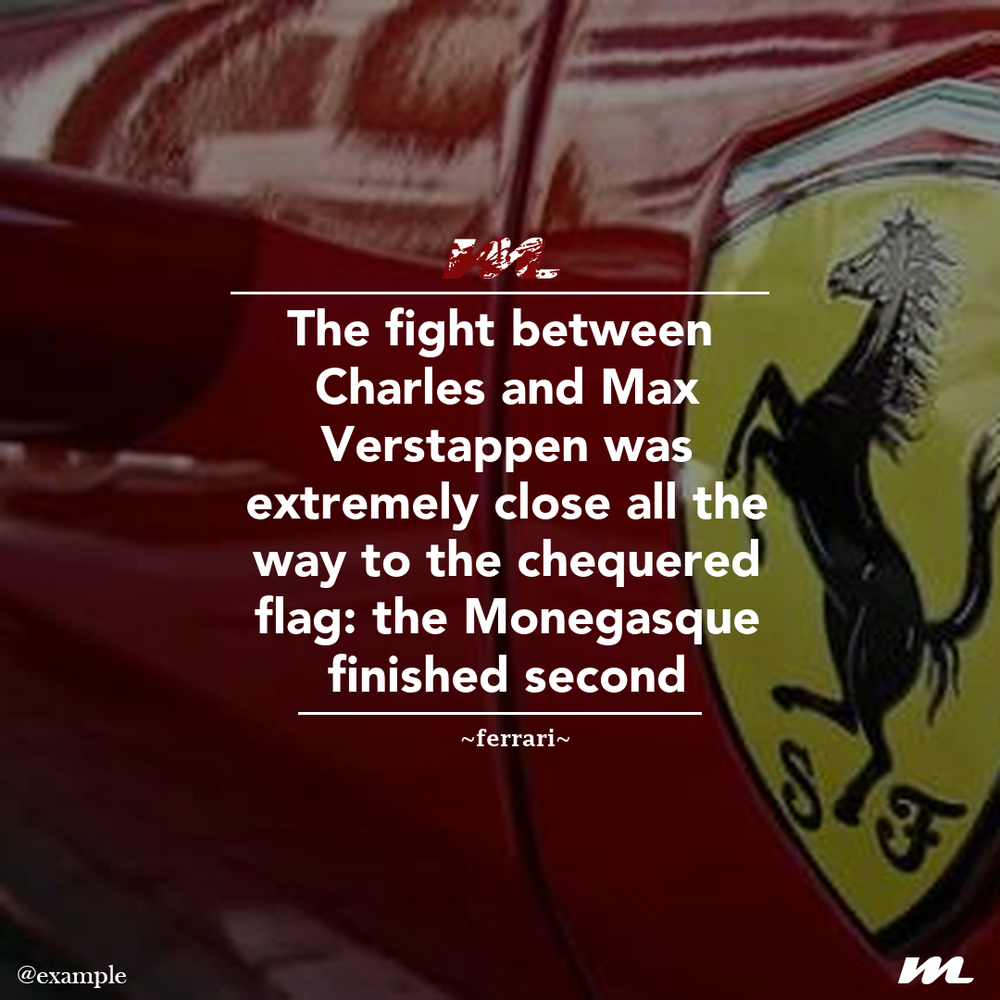

# article_post_creator
an algorithm that given a picture, a sentence and (optional) an author create a post for IG, adjusting the positions of the dividers in the post, the text dimension based on the text length and apply a small logo on the top which colour change according to the main image color 
# how it works
when you execute the main.py script the program will make you choice a pic to use and after that it will ask you for a sentence and than the name of the uthor that is optional.
After you've inserted the arguments the program will create the post searching for the main color of the selected image using a simple cluster algorithm and then it will size the test, apply the divider and the logo with the datail color chosen according to the main color of the pic chosen   
# text size
to resize the text size to fit all the content into the post i decided to subtract to the base character size (70) a logarithm function (yuo can find the code at the line 48 of the post_creator.py script)
# final result
the final result of the program looks like this:

  
  

